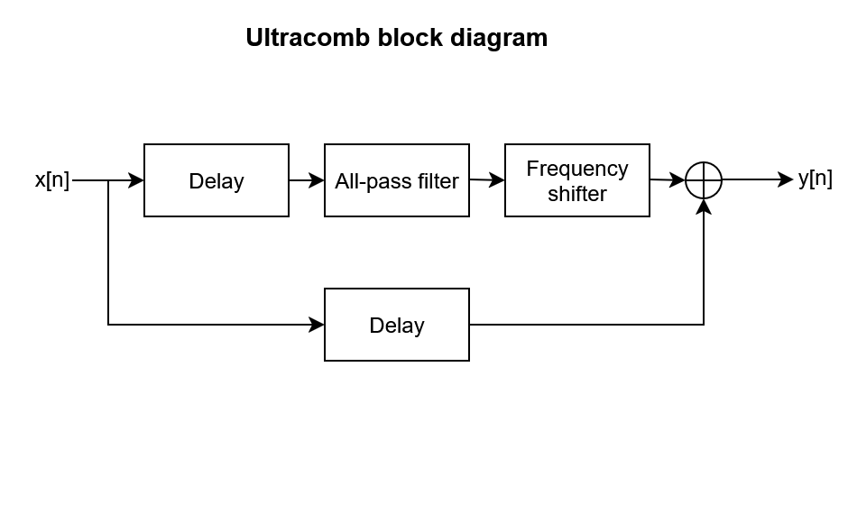

# Ultracomb

Ultracomb is a VST3/CLAP plugin that implements an audio effect chain described by the artist Au5 [here](https://www.youtube.com/watch?v=_SyB2WqKwP4).

## Audio details
The block diagram for the effect looks like this:


The phaser has 15 notches (all-pass filter of order 30)
The frequency shifter is implemented using "The third method" discover by Donald k. Weaver.

## Building

After installing [Rust](https://rustup.rs/), you can compile Ultracomb as follows:

```shell
cargo xtask bundle ultracomb --release
```

## To-do
- [X] Audio processing
    - [x] Flanging
        - [x] Interpolation for delays between samples
    - [x] Phasing
        - [x] All pass filter
        - [ ] Variable number of notches
    - [x] Frequency Shifter
        - [x] Low pass filter
        - [x] Quadrature oscillator
        - [x] Fade-in and out
        - [ ] Try other frequency shifting methods e.g. Hilbert Filter
    - [ ] Gain compensation
- [ ] CD
    - [x] Windows
    - [ ] Linux
    - [ ] MacOS
    - [ ] Releases
- [x] GUI
    - [ ] Add knobs instead of sliders
- [ ] Plug-in parameter definition
