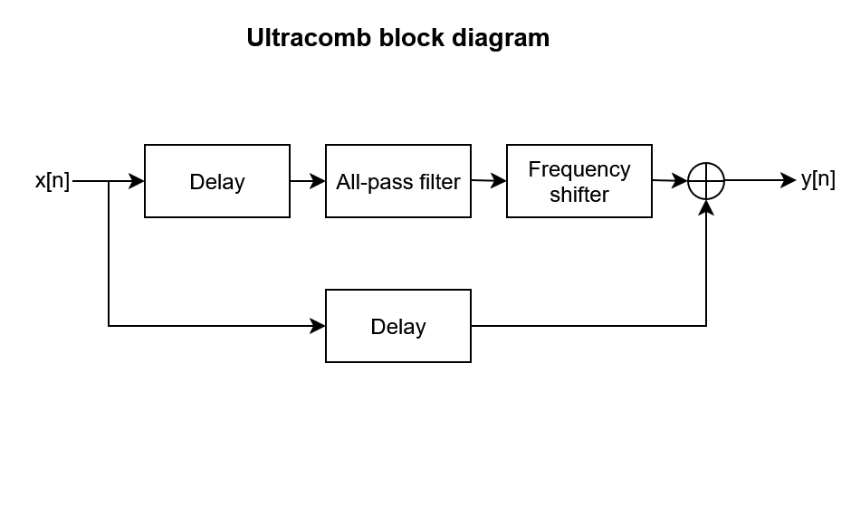

# Ultracomb

Ultracomb is a VST3/CLAP plugin that implements an audio effect chain described by the artist Au5 [here](https://www.youtube.com/watch?v=_SyB2WqKwP4).

Here is a demo of the plugin's effect on pink noise and a saw wave:

)

## Audio details
The block diagram for the effect looks like this:


The phaser has 9 notches (all-pass filter of order 18)
The frequency shifter is implemented using "The third method" discover by Donald k. Weaver.

## Download
You can find CLAP and VST3 binaries for Linux, Mac and Windows in the releases page.
Latest version: [link](https://github.com/Wasaka0/ultracomb/releases/latest/)
## Building

After installing [Rust](https://rustup.rs/), you can compile Ultracomb as follows:

```shell
cargo xtask bundle ultracomb --release
```

## To-do
- [X] Audio processing
    - [x] Flanging
        - [x] Interpolation for delays between samples
        - [x] Apply interpolation only when modifying delay
    - [x] Phasing
        - [x] All pass filter
        - [ ] Variable number of notches
    - [x] Frequency Shifter
        - [x] Low pass filter
            - [x] Changed to elliptic filter, which improves shifter output by attenuating more the unwanted frequency band with its steeper transition slope 
        - [x] Quadrature oscillator
        - [x] Fade-in and out
        - [x] Try other frequency shifting methods e.g. Hilbert Filter
            - [x] Tried without clear improvement right away
        - [x] Solve problems with DC, pre filtering might be enough
    - [x] Gain compensation
        - [x] ~~For Frequency shifter~~
        - [ ] ~~For Flanger/Phaser only~~
        - [x] Automatic gain compensation
    - [x] High-cut/Low-cut effect filtering (3 Band crossover filter)
    - [x] Effect multiplier
- [ ] CD
    - [x] Windows
    - [x] Linux
    - [x] MacOS
    - [ ] Automatic releases
    - [x] Unify CI script 
    - [x] Add version to artifact name
- [x] GUI
    - [ ] Add knobs instead of sliders
    - [x] Maybe switch to vizia-plug which is more recently updated than nih_plug_vizia 
- [ ] Plug-in parameter definition
- [ ] Performance
    - [ ] Design benchmarks
    - [ ] Improve performance
